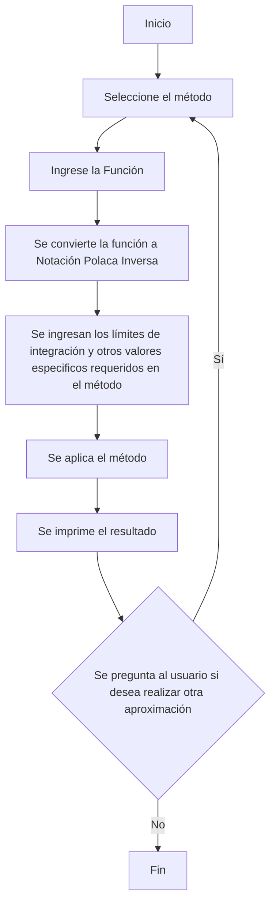
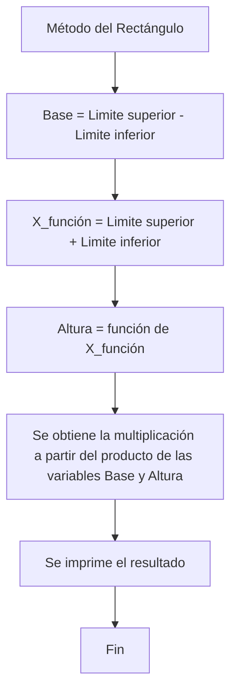

# Proyecto PDC

| Nombre                 | Identificación | Grupo | Trabajo          |
|------------------------|----------------|-------|------------------|
| Angélica Pascagaza Vega| 1031652163     |   5   | Trabajo individual |

## Índice

1. [Introducción](#Introducción)
2. [Conceptos Clave](#Conceptos-clave)
3. [Métodos numéricos](#Métodos-numéricos)
4. [Comparación de métodos](#Comparación-de-métodos)
5. [Diagramas de flujo](#Diagramas-de-flujo)
5. [Resultados](#Resultados)
6. [Conclusión](#Conclusión)
7. [Referencias](#Referencias)

## Introducción
En las aplicaciones prácticas de la integración se presentan situaciones que no tienen una solución analítica o directa de la integral. Por tal razón, son de gran utilidad los métodos numéricos de integración, los cuales permiten aproximar las integrales, haciendo posible resolver problemas que no son tratables de otro modo. Este proyecto tiene como objetivo facilitar la aplicación de estos métodos a través de un programa desarrollado en Python, el cual comprenda los métodos numéricos más utilizados a la hora de aproximar integrales definidas. 

## Conceptos clave
- **Función:** Relación matemática que asigna un valor de salida a cada valor de entrada.

- **Integral:** Representa el área bajo la curva de una función en un intervalo dado.

- **Puntos de evaluación:** Valores específicos en el dominio de la función donde se evalúa la función para aproximar la integral.
  
- **Pesos: Coeficientes** que se asignan a cada punto de evaluación para ponderar su contribución a la integral aproximada.
  
- **Métodos estadísticos:** En integración numérica se aplican para estimar el error y la precisión de las aproximaciones.
  
- **Extrapolación de Richardson:** Consiste en calcular la integral con diferentes tamaños de paso (distancia entre los puntos de evaluación) y luego combinar estos resultados para eliminar errores de orden inferior, obteniendo así una mejor estimación.
  
- **Polinomios de interpolación:** Se utilizan para aproximar una función mediante un polinomio que pasa por un conjunto de puntos conocidos.
  

## Métodos numéricos
1.	Método del rectángulo (Regla del punto medio)
Es una técnica básica de integración numérica en la que a partir del área de rectángulos se aproxima la integral de una función. Existen tres variaciones principales de este método: <i>regla del rectángulo izquierdo, regla del rectángulo derecho y regla del punto medio. </i> En esta ocasión únicamente se hace uso de la <b>regla del punto medio</b>, en donde se calcula la altura de los rectángulos a partir del valor de la función en el punto medio de cada subintervalo.
Fórmula:
2.	Método del Trapecio
En esta técnica se aproxima la integral definida de la función dividiendo el área bajo la curva en trapecios, lo que proporciona una estimación más precisa.
Fórmula:
3.	Método de Simpson
En este método se utilizan parábola para aproximar la integral de una función definida, debido a que se logran obtener mejores aproximaciones usando segmentos curvos en vez de líneas rectas.
Fórmula:
4.	Método del Trapecio Compuesto
Esta técnica aplica el método del trapecio en subintervalos más pequeños y suma los resultados, de tal manera que se mejora la precisión al dividir el intervalo en <i>n</i> subintervalos.
Formula:
5.	Método de Simpson Compuesto
Para esta aproximación se emplea la regla de Simpson en múltiples subintervalos del intervalo total, de esa manera se mejora la precisión.
Formula:
6.	Método del Trapecio Adaptativo
Esta técnica ajusta dinámicamente el tamaño de los subintervalos en función del error estimado, empleando más subdivisiones donde la función varia más y reduciendo el número donde la función es más suave.
<b>Procedimiento:</b> Inicialmente se divide el intervalo inicial y se calcula el error. Luego, se evalúa si el error es mayor que un umbral dado, de serlo, se subdivide en más partes los intervalos con mayor error. Y este proceso se repite hasta que el error en cada subintervalo esté dentro del límite tolerado.
7.	Método de Simpson Adaptativo
Similar a la técnica anterior, se ajustan los subintervalos según el error estimado, pero se utiliza la regla de Simpson.
<b>Procedimiento:</b> Inicialmente se divide el intervalo inicial y se calcula el error. Luego, se evalúa si el error es mayor que un umbral dado, de serlo, se subdivide en más partes los intervalos con mayor error. Y este proceso se repite hasta que el error en cada subintervalo esté dentro del límite tolerado.
8.	Cuadratura de Gauss-Legendre
En este método se utilizan los puntos de evaluación y los pesos optimizados para maximizar la exactitud en los polinomios de grado dado. 
Formula:
9.	Integración de Monte Carlo
En esta técnica se utilizan métodos estadísticos para aproximar la integral definida (bastante útiles en espacios de alta dimensión). Este consiste en la generación de números aleatorios para estimar el valor medio de la función.
<b>Procedimiento:</b> Primero se generan un grupo de puntos aleatorios en el dominio de la función y se evalúa la función en ellos. Luego se calcula la media de esas evaluaciones y se multiplica por el volumen del dominio.
10.	Integración de Romberg
Es un método de refinamiento que combina el <i>método del trapecio</i> con la <i>extrapolación de Richardson </i> para mejorar la precisión.
<b>Procedimiento:</b> Se inicia con el método del Trapecio Compuesto para después aplicar la extrapolación de Richardson repetidamente, con el fin de obtener estimaciones de orden superior de la integral.
11.	Método de Newton-Cotes Cerrado
Se utilizan polinomios de interpolación construidos a partir de puntos de evaluación equiespaciados que incluyen los extremos del intervalo.
12.	Método de Newton-Cotes Abierto
Esta técnica también utiliza polinomios de interpolación, pero los puntos de evaluación no incluyen los extremos del intervalo.

## Comparación de métodos
Cada método tiene sus propias aplicaciones y es adecuado para diferentes tipos de problemas de integración.

<table cellspacing="1" bgcolor="">
  <tr bgcolor="#252582">
    <th><b>Método</b></th>
    <th><b>Precisión</b></th>
    <th><b>Complejidad Computacional</b></th>
    <th><b>Facilidad de Implementación</b></th>
  </tr>
  <tr bgcolor="#e4e4ed">
    <td style="color:#141414" align="center">Método del Rectángulo</td>
    <td style="color:#141414" align="center">Baja</td>
    <td style="color:#141414" align="center">Baja</td>
    <td style="color:#141414" align="center">Alta</td>
  </tr>
  <tr bgcolor="#e4e4ed">
    <td style="color:#141414" align="center">Método del Trapecio</td>
    <td style="color:#141414" align="center">Moderada</td>
    <td style="color:#141414" align="center">Moderada</td>
    <td style="color:#141414" align="center">Moderada</td>
  </tr>
  <tr bgcolor="#e4e4ed">
    <td style="color:#141414" align="center">Método del Simpson</td>
    <td style="color:#141414" align="center">Alta</td>
    <td style="color:#141414" align="center">Moderada</td>
    <td style="color:#141414" align="center">Moderada</td>
  </tr>
  <tr bgcolor="#e4e4ed">
    <td style="color:#141414" align="center">Método del Trapecio Compuesto</td>
    <td style="color:#141414" align="center">Alta</td>
    <td style="color:#141414" align="center">Alta</td>
    <td style="color:#141414" align="center">Moderada</td>
  </tr>
  <tr bgcolor="#e4e4ed">
    <td style="color:#141414" align="center">Método de Simpson Compuesto</td>
    <td style="color:#141414" align="center">Muy alta</td>
    <td style="color:#141414" align="center">Alta</td>
    <td style="color:#141414" align="center">Moderada</td>
  </tr>
  <tr bgcolor="#e4e4ed">
    <td style="color:#141414" align="center">Método del Trapecio Adaptativo</td>
    <td style="color:#141414" align="center">Alta</td>
    <td style="color:#141414" align="center">Alta (adaptativo)</td>
    <td style="color:#141414" align="center">Moderada</td>
  </tr>
  <tr bgcolor="#e4e4ed">
    <td style="color:#141414" align="center">Método de Simpson Adaptativo</td>
    <td style="color:#141414" align="center">Muy alta</td>
    <td style="color:#141414" align="center">Alta (adaptativo)</td>
    <td style="color:#141414" align="center">Moderada</td>
  </tr>
  <tr bgcolor="#e4e4ed">
    <td style="color:#141414" align="center">Cuadratura de Gauss-Legendre</td>
    <td style="color:#141414" align="center">Muy alta</td>
    <td style="color:#141414" align="center">Alta</td>
    <td style="color:#141414" align="center">Baja</td>
  </tr>
  <tr bgcolor="#e4e4ed">
    <td style="color:#141414" align="center">Integración de Monte Carlo</td>
    <td style="color:#141414" align="center">Alta (con suficientes muestras)</td>
    <td style="color:#141414" align="center">Baja (para gran número de muestras)</td>
    <td style="color:#141414" align="center">Baja</td>
  </tr>
  <tr bgcolor="#e4e4ed">
    <td style="color:#141414" align="center">Integración de Romberg</td>
    <td style="color:#141414" align="center">Muy alta</td>
    <td style="color:#141414" align="center">Alta</td>
    <td style="color:#141414" align="center">Moderada</td>
  </tr>
  <tr bgcolor="#e4e4ed">
    <td style="color:#141414" align="center">Método de Newton-Cotes Cerrado</td>
    <td style="color:#141414" align="center">Moderada a Alta</td>
    <td style="color:#141414" align="center">Moderada</td>
    <td style="color:#141414" align="center">Moderada</td>
  </tr>
  <tr bgcolor="#e4e4ed">
    <td style="color:#141414" align="center">Método de Newton-Cotes Abierto</td>
    <td style="color:#141414" align="center">Moderada</td>
    <td style="color:#141414" align="center">Moderada</td>
    <td style="color:#141414" align="center">Moderada</td>
  </tr>
</table>

## Diagramas de flujo
Algoritmos aplicados en el programa

### Diagrama de Flujo del Programa General

### Diagrama de Flujo del Método del rectángulo (Regla del punto medio)

### Diagrama de Flujo del Método del Trapecio Simple

### Diagrama de Flujo del Método del rectángulo (Regla del punto medio)

### Diagrama de Flujo del Método del rectángulo (Regla del punto medio)

### Diagrama de Flujo del Método del rectángulo (Regla del punto medio)

### Diagrama de Flujo del Método del rectángulo (Regla del punto medio)

### Diagrama de Flujo del Método del rectángulo (Regla del punto medio)

### Diagrama de Flujo del Método del rectángulo (Regla del punto medio)

### Diagrama de Flujo del Método del rectángulo (Regla del punto medio)

### Diagrama de Flujo del Método del rectángulo (Regla del punto medio)

### Diagrama de Flujo del Método del rectángulo (Regla del punto medio)

### Diagrama de Flujo del Método del rectángulo (Regla del punto medio)

## Resultados
###Función compleja

## Conclusión

## Referencias

