# Proyecto PDC

| Nombre                 | Identificación | Grupo | Trabajo          |
|------------------------|----------------|-------|------------------|
| Angélica Pascagaza Vega| 1031652163     |   5   | Trabajo individual |

## Índice

1. [Introducción](#Introducción)
2. [Conceptos Clave](#Conceptos-clave)
3. [Métodos numéricos](#Métodos-numéricos)
4. [Comparación de métodos](#Comparación-de-métodos)
5. [Procedimiento](#Procedimiento)
5. [Resultados](#Resultados)
6. [Conclusión](#Conclusión)
7. [Referencias](#Referencias)

## Introducción
En las aplicaciones prácticas de la integración se presentan situaciones que no tienen una solución analítica o directa de la integral. Por tal razón, son de gran utilidad los métodos numéricos de integración, los cuales permiten aproximar las integrales, haciendo posible resolver problemas que no son tratables de otro modo. Este proyecto tiene como objetivo facilitar la aplicación de estos métodos a través de un programa desarrollado en Python, el cual comprenda los métodos numéricos más utilizados a la hora de aproximar integrales definidas. 

## Conceptos clave
- **Función:** Relación matemática que asigna un valor de salida a cada valor de entrada.

- **Integral:** Representa el área bajo la curva de una función en un intervalo dado.

- **Puntos de evaluación:** Valores específicos en el dominio de la función donde se evalúa la función para aproximar la integral.
  
- **Pesos:** Coeficientes que se asignan a cada punto de evaluación para ponderar su contribución a la integral aproximada.
  
- **Métodos estadísticos:** En integración numérica se aplican para estimar el error y la precisión de las aproximaciones.
  
- **Extrapolación de Richardson:** Consiste en calcular la integral con diferentes tamaños de paso (distancia entre los puntos de evaluación) y luego combinar estos resultados para eliminar errores de orden inferior, obteniendo así una mejor estimación.
  
- **Polinomios de interpolación:** Se utilizan para aproximar una función mediante un polinomio que pasa por un conjunto de puntos conocidos.
  

## Métodos numéricos
1.	**Método del rectángulo (Regla del punto medio)**
   
Es una técnica básica de integración numérica en la que a partir del área de rectángulos se aproxima la integral de una función. Existen tres variaciones principales de este método: <i>regla del rectángulo izquierdo, regla del rectángulo derecho y regla del punto medio. </i> En esta ocasión únicamente se hace uso de la <b>regla del punto medio</b>, en donde se calcula la altura de los rectángulos a partir del valor de la función en el punto medio de cada subintervalo.

**Fórmula:**

$$\int_{a}^{b} f(x) \ dx \approx (b-a) \cdot f\left(\frac{a+b}{2}\right)$$

2.	**Método del Trapecio**

En esta técnica se aproxima la integral definida de la función dividiendo el área bajo la curva en trapecios, lo que proporciona una estimación más precisa.

**Fórmula:**

$$\int_{a}^{b} f(x) \ dx \approx \frac{b-a}{2} \left( f(a) + f(b) \right)$$

3.	**Método de Simpson**

En este método se utilizan parábola para aproximar la integral de una función definida, debido a que se logran obtener mejores aproximaciones usando segmentos curvos en vez de líneas rectas.

**Fórmula:**

$$\int_{a}^{b} f(x) \ dx \approx \frac{b-a}{6} \left( f(a) + 4f\left(\frac{a+b}{2}\right) + f(b) \right)$$

4.	**Método del Trapecio Compuesto**

Esta técnica aplica el método del trapecio en subintervalos más pequeños y suma los resultados, de tal manera que se mejora la precisión al dividir el intervalo en <i>n</i> subintervalos.

**Formula:**

$$\int_{a}^{b} f(x) \ dx \approx \frac{b-a}{2n} \left( f(a) + 2 \cdot \sum_{k=1}^{n-1} f\left(x_{k}\right) + f(b) \right)$$

5.	**Método de Simpson Compuesto**

Para esta aproximación se emplea la regla de Simpson en múltiples subintervalos del intervalo total, de esa manera se mejora la precisión.

**Formula:**

$$\int_{a}^{b} f(x) \ dx \approx \frac{b-a}{3n} \left( f(a) + 4 \sum_{k=1}^{n-1} f\left( x_{k} \right) + 2 \sum_{k=1}^{n-2} f\left(x_{k}\right) + f(b) \right)$$

6.	**Método del Trapecio Adaptativo**

Esta técnica ajusta dinámicamente el tamaño de los subintervalos en función del error estimado, empleando más subdivisiones donde la función varia más y reduciendo el número donde la función es más suave.

<b>Procedimiento:</b> Inicialmente se divide el intervalo inicial y se calcula el error. Luego, se evalúa si el error es mayor que un umbral dado, de serlo, se subdivide en más partes los intervalos con mayor error. Y este proceso se repite hasta que el error en cada subintervalo esté dentro del límite tolerado.

7.	**Método de Simpson Adaptativo**

Similar a la técnica anterior, se ajustan los subintervalos según el error estimado, pero se utiliza la regla de Simpson.

<b>Procedimiento:</b> Inicialmente se divide el intervalo inicial y se calcula el error. Luego, se evalúa si el error es mayor que un umbral dado, de serlo, se subdivide en más partes los intervalos con mayor error. Y este proceso se repite hasta que el error en cada subintervalo esté dentro del límite tolerado.

8.	**Cuadratura de Gauss-Legendre**

En este método se utilizan los puntos de evaluación y los pesos optimizados para maximizar la exactitud en los polinomios de grado dado. 

**Formula:**

$$\int_{a}^{b} f(x) \ dx \approx \frac{b-a}{2} \cdot \sum_{i=1}^{n} w_i \cdot f\left(\frac{b-a}{2} x_i + \frac{a+b}{2}\right)$$

9.	**Integración de Monte Carlo**

En esta técnica se utilizan métodos estadísticos para aproximar la integral definida (bastante útiles en espacios de alta dimensión). Este consiste en la generación de números aleatorios para estimar el valor medio de la función.

<b>Procedimiento:</b> Primero se generan un grupo de puntos aleatorios en el dominio de la función y se evalúa la función en ellos. Luego se calcula la media de esas evaluaciones y se multiplica por el volumen del dominio.

10.	**Integración de Romberg**

Es un método de refinamiento que combina el <i>método del trapecio</i> con la <i>extrapolación de Richardson </i> para mejorar la precisión.

<b>Procedimiento:</b> Se inicia con el método del Trapecio Compuesto para después aplicar la extrapolación de Richardson repetidamente, con el fin de obtener estimaciones de orden superior de la integral.

11.	**Método de Newton-Cotes Cerrado**

Se utilizan polinomios de interpolación construidos a partir de puntos de evaluación equiespaciados que incluyen los extremos del intervalo.

12.	**Método de Newton-Cotes Abierto**

Esta técnica también utiliza polinomios de interpolación, pero los puntos de evaluación no incluyen los extremos del intervalo.


## Comparación de métodos
Cada método tiene sus propias aplicaciones y es adecuado para diferentes tipos de problemas de integración.

<table cellspacing="1" bgcolor="">
  <tr bgcolor="#252582">
    <th><b>Método</b></th>
    <th><b>Precisión</b></th>
    <th><b>Complejidad Computacional</b></th>
    <th><b>Facilidad de Implementación</b></th>
  </tr>
  <tr bgcolor="#e4e4ed">
    <td style="color:#141414" align="center">Método del Rectángulo</td>
    <td style="color:#141414" align="center">Baja</td>
    <td style="color:#141414" align="center">Baja</td>
    <td style="color:#141414" align="center">Alta</td>
  </tr>
  <tr bgcolor="#e4e4ed">
    <td style="color:#141414" align="center">Método del Trapecio</td>
    <td style="color:#141414" align="center">Moderada</td>
    <td style="color:#141414" align="center">Moderada</td>
    <td style="color:#141414" align="center">Moderada</td>
  </tr>
  <tr bgcolor="#e4e4ed">
    <td style="color:#141414" align="center">Método del Simpson</td>
    <td style="color:#141414" align="center">Alta</td>
    <td style="color:#141414" align="center">Moderada</td>
    <td style="color:#141414" align="center">Moderada</td>
  </tr>
  <tr bgcolor="#e4e4ed">
    <td style="color:#141414" align="center">Método del Trapecio Compuesto</td>
    <td style="color:#141414" align="center">Alta</td>
    <td style="color:#141414" align="center">Alta</td>
    <td style="color:#141414" align="center">Moderada</td>
  </tr>
  <tr bgcolor="#e4e4ed">
    <td style="color:#141414" align="center">Método de Simpson Compuesto</td>
    <td style="color:#141414" align="center">Muy alta</td>
    <td style="color:#141414" align="center">Alta</td>
    <td style="color:#141414" align="center">Moderada</td>
  </tr>
  <tr bgcolor="#e4e4ed">
    <td style="color:#141414" align="center">Método del Trapecio Adaptativo</td>
    <td style="color:#141414" align="center">Alta</td>
    <td style="color:#141414" align="center">Alta (adaptativo)</td>
    <td style="color:#141414" align="center">Moderada</td>
  </tr>
  <tr bgcolor="#e4e4ed">
    <td style="color:#141414" align="center">Método de Simpson Adaptativo</td>
    <td style="color:#141414" align="center">Muy alta</td>
    <td style="color:#141414" align="center">Alta (adaptativo)</td>
    <td style="color:#141414" align="center">Moderada</td>
  </tr>
  <tr bgcolor="#e4e4ed">
    <td style="color:#141414" align="center">Cuadratura de Gauss-Legendre</td>
    <td style="color:#141414" align="center">Muy alta</td>
    <td style="color:#141414" align="center">Alta</td>
    <td style="color:#141414" align="center">Baja</td>
  </tr>
  <tr bgcolor="#e4e4ed">
    <td style="color:#141414" align="center">Integración de Monte Carlo</td>
    <td style="color:#141414" align="center">Alta (con suficientes muestras)</td>
    <td style="color:#141414" align="center">Baja (para gran número de muestras)</td>
    <td style="color:#141414" align="center">Baja</td>
  </tr>
  <tr bgcolor="#e4e4ed">
    <td style="color:#141414" align="center">Integración de Romberg</td>
    <td style="color:#141414" align="center">Muy alta</td>
    <td style="color:#141414" align="center">Alta</td>
    <td style="color:#141414" align="center">Moderada</td>
  </tr>
  <tr bgcolor="#e4e4ed">
    <td style="color:#141414" align="center">Método de Newton-Cotes Cerrado</td>
    <td style="color:#141414" align="center">Moderada a Alta</td>
    <td style="color:#141414" align="center">Moderada</td>
    <td style="color:#141414" align="center">Moderada</td>
  </tr>
  <tr bgcolor="#e4e4ed">
    <td style="color:#141414" align="center">Método de Newton-Cotes Abierto</td>
    <td style="color:#141414" align="center">Moderada</td>
    <td style="color:#141414" align="center">Moderada</td>
    <td style="color:#141414" align="center">Moderada</td>
  </tr>
</table>


## Procedimiento
En esta sección se encontrarán los diagramas de flujo preliminares y finalmente cómo se construyó en Python.

### Diagrama de Flujo del Programa General
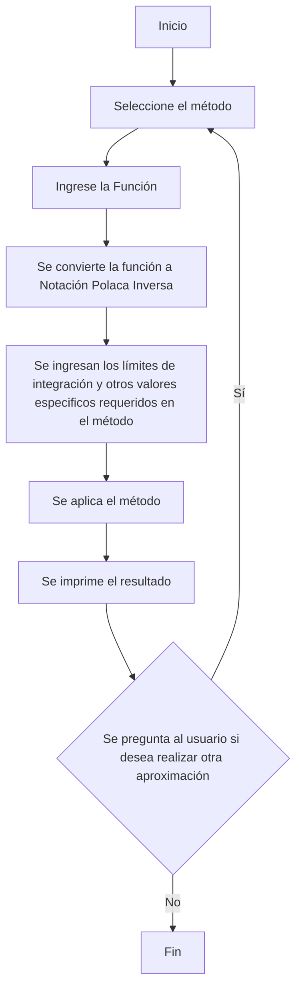

### Método del rectángulo (Regla del punto medio)

```python
def rectangulo_simple():

    #Se definen las variables para los límites de integración
    a : float = 0
    b : float = 0

    #Se ingresa la función y los límites de integración
    funcion : str = ingresar_funcion()
    a,b = limites_integracion()

    #Se define la variable a integrar
    variable : str = input("Ingrese la variable por la cual se va a integrar: ")

    """
    Para este método se utiliza la siguiente formula
    para realizar la aproximación de la integral: (b-a)*f((a+b)/2)
    """

    base : float = b-a
    x_funcion : float = (a+b)/2

    #Se define un diccionario para evaluar la variable en la función
    variables = {variable : x_funcion}
    altura : float = evaluar_expresion(funcion, variables)
    resultado : float = base*altura

    #Se imprime el resultado
    print(f"Por el método del Réctangulo Simple, el resultado es {resultado}")

    return
```

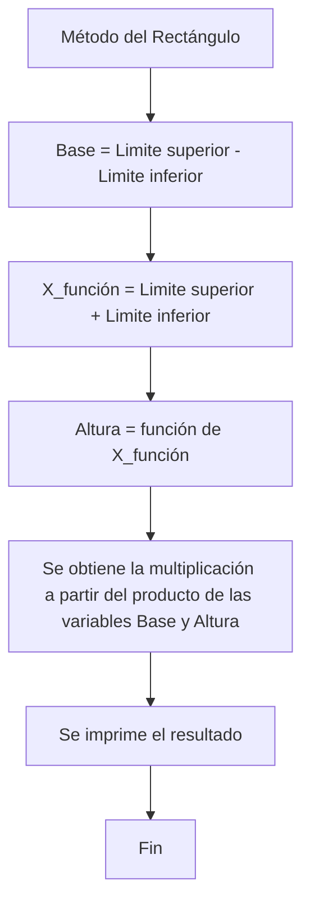

### Método del Trapecio Simple

```python
def trapecio_simple():

    #Se definen las variables para los límites de integración
    a : float = 0
    b : float = 0

    #Se ingresa la función y los límites de integración
    funcion : str = ingresar_funcion()
    a,b = limites_integracion()

    #Se define la variable a integrar
    variable : str = input("Ingrese la variable por la cual se va a integrar: ")

    """
    Para este método se utiliza la siguiente formula
    para realizar la aproximación de la integral: ((b-a)/2) * [f(a)+f(b)]
    """

    base : float = (b-a)/2

    #Se define un diccionario para evaluar la variable en la función
    funcion_a = {variable : a}
    funcion_b = {variable : b}
    resultado_a : float = evaluar_expresion(funcion, funcion_a)
    resultado_b : float = evaluar_expresion(funcion, funcion_b)
    resultado : float = base*(resultado_a+resultado_b)

    #Se imprime el resultado
    print(f"Por el método del Trapecio Simple, el resultado es {resultado}")

    return
```

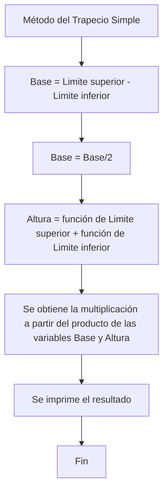

### Método de Simpson Simple

```python
def simpson_simple():

    #Se definen las variables para los límites de integración
    a : float = 0
    b : float = 0

    #Se ingresa la función y los límites de integración
    funcion : str = ingresar_funcion()
    a,b = limites_integracion()

    #Se define la variable a integrar
    variable : str = input("Ingrese la variable por la cual se va a integrar: ")

    """Para este método se utiliza la siguiente formula
    para realizar la aproximación de la integral: ((b-a)/6) * [f(a) + 4*f((a+b)/2) + f(b)]
    """
    base : float = (b-a)/6
    c : float = (a+b)/2

    #Se define un diccionario para evaluar la variable en la función
    funcion_a = {variable : a}
    funcion_b = {variable : b}
    funcion_c = {variable : c}
    resultado_a : float = evaluar_expresion(funcion, funcion_a)
    resultado_b : float = evaluar_expresion(funcion, funcion_b)
    resultado_c : float = evaluar_expresion(funcion, funcion_c)
    resultado : float = base*(resultado_a + resultado_b + 4*resultado_c)

    #Se imprime el resultado
    print(f"Por el método del Simpson Simple, el resultado es {resultado}")
    return
```

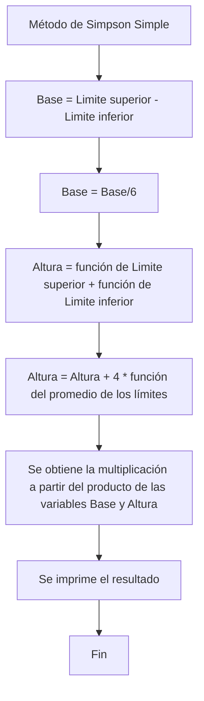

### Método del Trapecio Compuesto

```python
def trapecio_compuesto():

    #Se definen las variables para los límites de integración
    a : float = 0
    b : float = 0

    #Se ingresa la función y los límites de integración
    funcion : str = ingresar_funcion()
    a,b = limites_integracion()

    #Se define la variable a integrar y el número de subintervalos
    variable : str = input("Ingrese la variable por la cual se va a integrar: ")
    n : int = int(input("Introduce el número de subintervalos: "))

    """Para este método se utiliza la siguiente formula
    para realizar la aproximación de la integral: 
    (h/2) * [f(a) + 2 ∑ i=1 n-1 f(a+ih) + f(b)]
    """
    #Se define la variable base del intervalo
    h : float = (b - a) / n

    #Se evalúan los extremos iniciales
    funcion_a : dict= {variable: a}
    funcion_b : dict= {variable: b}
    resultado_a : float= evaluar_expresion(funcion, funcion_a)
    resultado_b : float= evaluar_expresion(funcion, funcion_b)

    #Suma de los extremos
    resultado : float = (resultado_a + resultado_b)

    result : float = 0

    #Se calcula el área de los subintervalos
    for i in range(1, n):
        x = a + i * h
        funcion_x = {variable: x}
        result += evaluar_expresion(funcion, funcion_x)

    resultado += (result*2)

    #Se multiplica por el tamaño de los subintervalos
    resultado *= (h/2)

    #Se imprime el resultado
    print(f"Por el método del Trapecio compuesto, el resultado es {resultado}")

    return
```

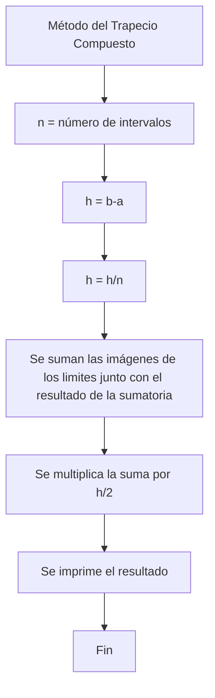

### Método de Simpson Compuesto

```python
def simpson_compuesto():

    #Se definen las variables para los límites de integración
    a : float = 0
    b : float = 0

    #Se ingresa la función y los límites de integración
    funcion : str = ingresar_funcion()
    a,b = limites_integracion()

    #Se define la variable a integrar y el número de subintervalos
    variable : str = input("Ingrese la variable por la cual se va a integrar: ")
    n : int = int(input("Introduce el número de subintervalos (debe ser un número par): "))

    if n % 2 != 0:
        raise ValueError("El número de subintervalos debe ser par.")

    """Para este método se utiliza la siguiente formula
    para realizar la aproximación de la integral:
    (h/3) * [f(a) + 4 ∑ n-1 i=1,3,5... f(a+ih) + 2 ∑ n-2 i=2,4,6... f(a+ih) + f(b)]
    """
    #Se define la variable base del intervalo
    h : float = (b - a) / n

    #Se evalúan los extremos iniciales
    funcion_a : dict = {variable: a}
    funcion_b : dict = {variable: b}
    resultado_a : float= evaluar_expresion(funcion, funcion_a)
    resultado_b : float= evaluar_expresion(funcion, funcion_b)

    #Inicializar suma de Simpson
    resultado : float = resultado_a + resultado_b

    #Sumar las evaluaciones de los puntos intermedios
    for i in range(1, n):
        x = a + i * h
        funcion_x = {variable: x}
        if i % 2 == 0:
            resultado += 2 * evaluar_expresion(funcion, funcion_x)
        else:
            resultado += 4 * evaluar_expresion(funcion, funcion_x)

    #Se multiplica por el tamaño de los subintervalos y se divide por 3
    resultado *= h / 3

    #Se imprime el resultado
    print(f"Por el método del Simpson compuesto, el resultado es {resultado}")

    return
```

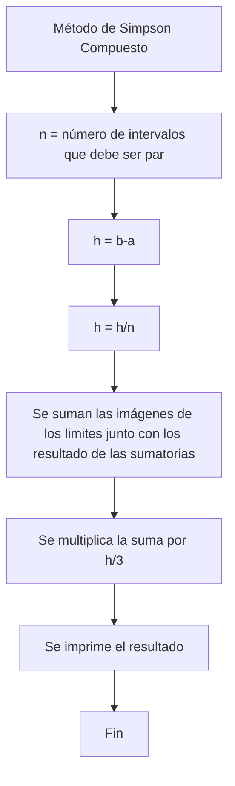

### Método del Trapecio Adaptativo

```python
def trapecio_adaptativo():

    #Se definen las variables para los límites de integración
    a : float = 0
    b : float = 0

    #Se ingresa la función y los límites de integración
    funcion : str = ingresar_funcion()
    a,b = limites_integracion()

    #Se define la variable a integrar y la tolerancia
    variable : str = input("Ingrese la variable por la cual se va a integrar: ")
    tol : float = float(input("Introduce la tolerancia: "))

    """
    Para este método se utiliza el método del trapecio simple,
    en donde se implementa un criterio de adaptación.
    """

    resultado : float = trapecio_adaptativo_funcion(funcion, a, b, variable, tol)

    #Se imprime el resultado
    print(f"Por el método del Trapecio Adaptativo, el resultado es {resultado}")

    return
```

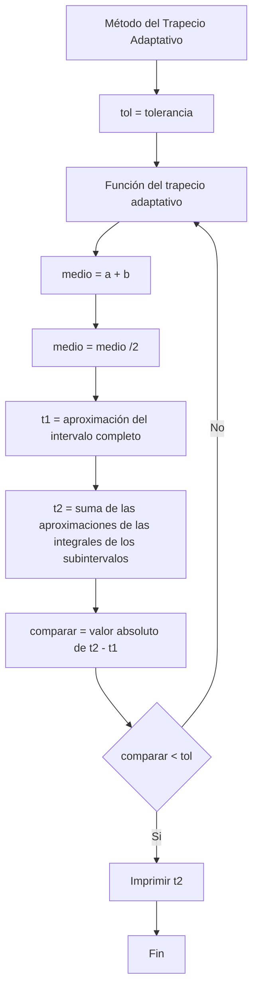

### Método de Simpson Adaptativo

```python
def simpson_adaptativo():

    #Se definen las variables para los límites de integración
    a : float = 0
    b : float = 0

    #Se ingresa la función y los límites de integración
    funcion : str = ingresar_funcion()
    a,b = limites_integracion()

    #Se define la variable a integrar y la tolerancia
    variable : str = input("Ingrese la variable por la cual se va a integrar: ")
    tol : float = float(input("Introduce la tolerancia: "))

    """Para este método se apoya del método simpson simple
    y se parte de un criterio de adaptación.
    """
    resultado : float  = simpson_adaptativo_funcion(funcion, a, b, variable, tol)

    #Se imprime el resultado
    print(f"Por el método del Simpson Adaptativo, el resultado es {resultado}")
    return
```

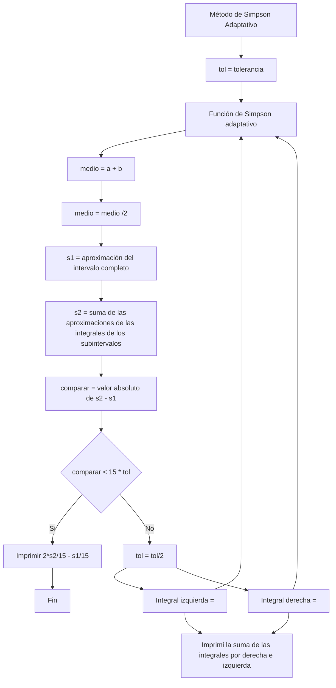

### Método de Cuadratura de Gauss-Legendre

```python
def Gauss_Legendre():

    #Se definen las variables para los límites de integración
    a : float = 0
    b : float = 0

    #Se ingresa la función y los límites de integración
    funcion : str = ingresar_funcion()
    a,b = limites_integracion()

    #Número de puntos de Gauss-Legendre
    n : int = int(input("Introduce el número de puntos para la cuadratura de Gauss-Legendre: "))

    #Calcular la integral utilizando la cuadratura de Gauss-Legendre
    resultado : float = cuadratura_gauss_legendre(funcion, a, b, n)

    #Imprimir el resultado
    print(f"La aproximación de la integral utilizando la cuadratura de Gauss-Legendre es: {resultado}")

    return
```

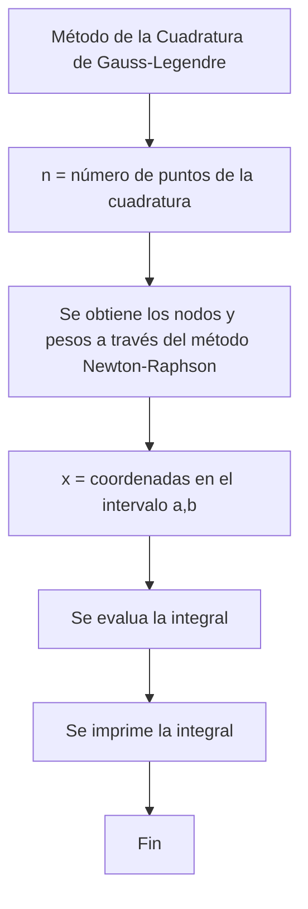

### Método de Monte Carlo

```python
def monte_Carlo():

    #Se definen las variables para los límites de integración
    a : float = 0
    b : float = 0

    #Se ingresa la función y los límites de integración
    funcion : str = ingresar_funcion()
    a,b = limites_integracion()

    #Número de puntos de la muestra
    n : int = int(input("Introduce el número de puntos de la muestra: "))

    """
    Para este método se utiliza la siguiente formula
    para realizar la aproximación de la integral: 
    (b-a)/n * ∑ i=1 n f(x_i)
    """

    #Calcular la integral utilizando el método de Monte Carlo
    resultado : float = monte_Carlo_funcion(funcion, a, b, n)

    #Imprimir el resultado
    print(f"La aproximación de la integral con el método de Monte Carlo: {resultado}")

    return
```

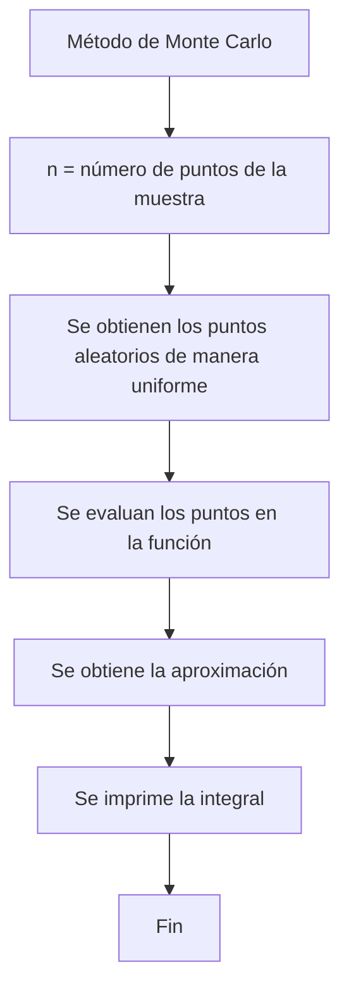

### Método de Romberg

```python
def romberg():
    
    #Se definen las variables para los límites de integración
    a : float = 0
    b : float = 0

    #Se ingresa la función y los límites de integración
    funcion : str = ingresar_funcion()
    a,b = limites_integracion()

    #Número máximo de iteraciones (profundidad de la tabla de Romberg)
    max_iter : int = int(input("Introduce el número máximo de iteraciones: "))

    """
    Para esta técnica se integra por trapecios a diferentes niveles de refinación, 
    luego se utiliza la extrapolación de Richardson para mejorar la precisión de la estimación de la integral.
    """

    #Calcular la integral utilizando el método Romberg
    resultado = romberg_funcion(funcion, a, b, max_iter)

    #Mostrar la tabla de Romberg
    print("Tabla de Romberg:")
    for i in range(len(resultado)):
        for j in range(i + 1):
            print(f"resultado[{i}][{j}] = {resultado[i][j]:.10f}", end="  ")
    print()

    return
```

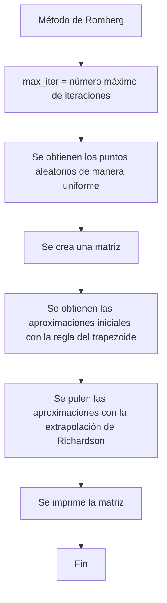

### Método de Newton Cotes-Cerrado

```python
def newton_cotes_cerrado():

    #Se definen las variables para los límites de integración
    a : float = 0
    b : float = 0

    #Se ingresa la función y los límites de integración
    funcion : str = ingresar_funcion()
    a,b = limites_integracion()

    #Número máximo de iteraciones (profundidad de la tabla de Romberg)
    n : int = int(input("Introduce el número de subintervalos: "))

    #Se define la variable a integrar
    variable : str = input("Ingrese la variable por la cual se va a integrar: ")

    #Ancho de cada subintervalo
    h : float = (b - a) / n

    """
    Se utiliza un polinomio interpolador en el intervalo cerrado [a,b].
    La fórmula básica es:
    I ≈ (b-a)/n * [f(a)/2 + ∑ i=1 n-1 f(a+i*h) + f(b)/2]
    """
    #Suma de los términos internos
    suma = 0.0
    for i in range(1, n):
        x_i = a + i * h
        suma += evaluar_expresion(funcion, {variable : x_i})

    #Se aplica la fórmula de Newton-Cotes cerrado
    integral : float= (h / 2) * (evaluar_expresion(funcion, {variable : a}) + 2 * suma + evaluar_expresion(funcion, {variable : b}))

    #Imprimir el resultado
    print(f"La aproximación de la integral con el método de Monte Carlo: {integral}")

    return
```

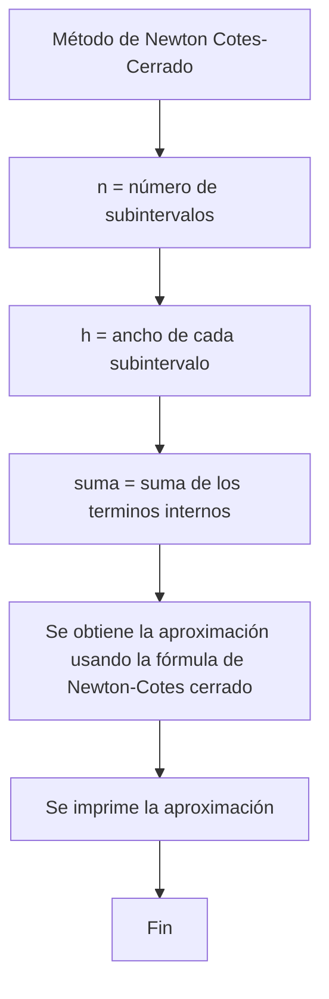

### Método de Newton-Cotes Abierto

```python
def newton_cotes_abierto():

    #Se definen las variables para los límites de integración
    a : float = 0
    b : float = 0

    #Se ingresa la función y los límites de integración
    funcion : str = ingresar_funcion()
    a,b = limites_integracion()

    #Número máximo de iteraciones (profundidad de la tabla de Romberg)
    n : int = int(input("Introduce el número de subintervalos: "))

    #Se define la variable a integrar
    variable : str = input("Ingrese la variable por la cual se va a integrar: ")

    #Ancho de cada subintervalo
    h : float = (b - a) / n

    """
    Se utiliza una fórmula de interpolación polinómica basada en puntos internos
    La fórmula general es:
    I ≈ (b-a)/n * [1/(n+1) * ∑ i=1 n f(a+i*h)]
    """

    #Suma de los términos internos
    suma = 0.0
    for i in range(1, n + 1):
        x_i = a + i * h
        suma += evaluar_expresion(funcion, {variable : x_i})

    #Aplicar la fórmula de Newton-Cotes abierto
    integral : float = h * (suma / (n + 1))

    #Imprimir el resultado
    print(f"La aproximación de la integral con el método de Monte Carlo: {integral}")

    return
```

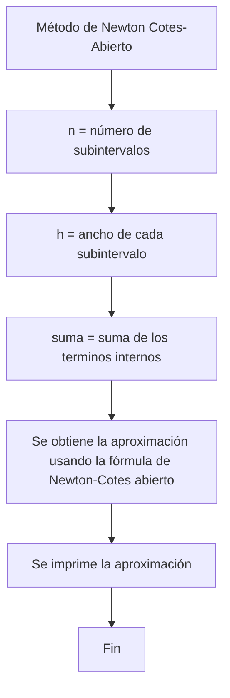


## Resultados
Para evaluar la exactitud de los métodos, se planteó la siguiente integral y se obtuvieron las aproximaciones con todos los métodos

$$
\int_{18}^{30} \left( x^3 + \sin(2x) - 2x^2 + 15 \right)
$$

1. Método del Rectángulo (Regla del punto medio)

[](https://postimg.cc/v4bFBLTf)

2. Método del Trapecio

[](https://postimg.cc/KRnhxsGm)

3. Método de Simpson

[](https://postimg.cc/0KSR6V7d)

4. Método del Trapecio Compuesto

[](https://postimg.cc/1fxZxZZW)

5. Método de Simpson Compuesto

[](https://postimg.cc/8J9gP2fz)

6. Método del Trapecio Adaptativo

[](https://postimg.cc/RqJzbZ26)

7. Método de Simpson Adaptativo

[](https://postimg.cc/B8Z0hcG4)

8. Cuadratura de Gauss-Legendre

[](https://postimg.cc/bZ3Mw7Kf)

9. Integración de Monte Carlo

[](https://postimg.cc/fVNZdQ23)

10. Integración de Romberg

[](https://postimg.cc/HcVCmYxN)

11. Método de Newton-Cotes Cerrado

[](https://postimg.cc/yJfz2gV9)

12. Método de Newton-Cotes Abierto

[](https://postimg.cc/RWLmQpyg)


## Conclusión
El desarrollo de este proyecto no solo cumplió la función de afianzar los conocimientos obtenido durante el curso, sino que también ha dado una gran perfectiva sobre algunos de los métodos numéricos. Este programa permite comprar los métodos numéricos a través de su presión y eficiencia de diferentes técnicas de integración, adaptándose a distintas características de las funciones a integrar. 

Este programa ha dejado en evidencia que la selección del método depende de la función específica, además de que las aproximaciones dependen del intervalo de integración y la precisión requerida. De esa manera, los métodos compuestos y adaptativos generalmente son superiores en términos de precisión, mientras que métodos como Monte Carlo y Gauss-Legendre ofrecen ventajas en situaciones especiales.

Para concluir, el desarrollo y aplicación de este proyecto ha llevado a solidificar los cocimientos ya adquiridos. Al tiempo que se realizaba una tarea interdisciplinar en la que se lograron evaluar distintos aspectos de las integrales, tales que ayudaron a comprender con precisión las diferencias entre los métodos.

## Bibiografía
1. Burden, R. L., & Faires, J. D. (2011). **Numerical Analysis** (9th ed.). Brooks/Cole. (Método del rectángulo)

2. Chapra, S. C., & Canale, R. P. (2015). **Numerical Methods for Engineers** (7th ed.). McGraw-Hill Education. (Método del Trapecio)

3. Kiusalaas, J. (2013). **Numerical Methods in Engineering with Python 3**. Cambridge University Press. (Método de Simpson)

4. Atkinson, K. E. (1989). **An Introduction to Numerical Analysis** (2nd ed.). John Wiley & Sons. (Método del Trapecio Compuesto)

5. Burden, R. L., & Faires, J. D. (2011). **Numerical Analysis** (9th ed.). Brooks/Cole. (Método de Simpson Compuesto)

6. Press, W. H., Teukolsky, S. A., Vetterling, W. T., & Flannery, B. P. (2007). **Numerical Recipes: The Art of Scientific Computing** (3rd ed.). Cambridge University Press. (Método del Trapecio Adaptativo)

7. Press, W. H., Teukolsky, S. A., Vetterling, W. T., & Flannery, B. P. (2007). **Numerical Recipes: The Art of Scientific Computing** (3rd ed.). Cambridge University Press. (Método de Simpson Adaptativo)

8. Hamming, R. W. (1973). **Numerical Methods for Scientists and Engineers** (2nd ed.). Dover Publications. (Cuadratura de Gauss-Legendre)

9. Metropolis, N., & Ulam, S. (1949). The Monte Carlo Method. *Journal of the American Statistical Association, 44*(247), 335-341. (Integración de Monte Carlo)

10. Stoer, J., & Bulirsch, R. (2002). **Introduction to Numerical Analysis** (3rd ed.). Springer. (Integración de Romberg)

11. Davis, P. J., & Rabinowitz, P. (1984). **Methods of Numerical Integration** (2nd ed.). Academic Press. (Método de Newton-Cotes Cerrado)

12. Davis, P. J., & Rabinowitz, P. (1984). **Methods of Numerical Integration** (2nd ed.). Academic Press. (Método de Newton-Cotes Abierto)

